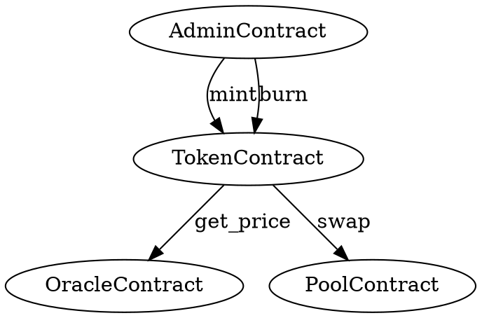

Sanctifier ships several utility commands beyond the core analysis and verification tools. These commands cover contract call-graph visualization, live-reload development workflows, security badge generation, report export, project initialization, and binary self-update. Each is documented below with its full flag set and practical examples.

---

## callgraph

`sanctifier callgraph` analyzes every `.rs` file under the target path for `env.invoke_contract` calls and emits a [Graphviz DOT](https://graphviz.org/doc/info/lang.html) file that represents the cross-contract call graph. This is useful for understanding the attack surface of multi-contract systems and identifying which contracts have authority over others.

**Usage:**

```bash
sanctifier callgraph [OPTIONS] [PATH]
```

<ParamField path="PATH" type="string" default=".">
  Path to a contract directory, workspace directory, or a single `.rs` file.
  Sanctifier recursively collects all `.rs` files, skipping paths in
  `ignore_paths` from `.sanctify.toml`.
</ParamField>

<ParamField query="--output" type="string" default="callgraph.dot">
  Output DOT file path. The file is overwritten if it already exists.
</ParamField>

**Examples:**

Generate a call graph for the current workspace and open it with Graphviz:

```bash
sanctifier callgraph . --output callgraph.dot
dot -Tsvg callgraph.dot -o callgraph.svg
open callgraph.svg
```

Generate a call graph for a single contract:

```bash
sanctifier callgraph ./contracts/amm-pool --output amm-callgraph.dot
```

**Sample output:**

```
✅ Wrote call graph to "callgraph.dot" (4 edges)
```

**Sample DOT content:**



Render with any Graphviz-compatible tool — `dot`, `neato`, online viewers like [viz-js.com](https://viz-js.com/), or IDE plugins. The contract name is inferred from the `#[contract]` attribute on the `struct` declaration; if no attribute is found, the file stem is used.

<Tip>
  Combine `sanctifier callgraph` with `sanctifier analyze` to understand which
  callers reach vulnerable entrypoints. High-severity `AUTH_GAP` findings on a
  contract that is reachable from many callers represent a larger blast radius.
</Tip>

---

## watch

`sanctifier watch` monitors the source files under a path and automatically re-runs `sanctifier analyze` whenever a `.rs` file changes. Changes are debounced to avoid flooding the terminal during rapid edits. This is the recommended workflow during active contract development.

**Usage:**

```bash
sanctifier watch [OPTIONS]
```

<ParamField query="--path" type="string" default=".">
  Path to a contract directory, workspace, or single `.rs` file to watch.
</ParamField>

<ParamField query="--debounce" type="number" default="300">
  Debounce window in milliseconds. After a file change is detected, Sanctifier
  waits this many milliseconds before re-running analysis. This prevents
  repeated runs during rapid saves (e.g. auto-save in an IDE).
</ParamField>

<ParamField query="--format" type="text | json" default="text">
  Output format passed through to the underlying `analyze` invocation. Use
  `json` if you want to pipe live results into a tool that consumes JSON.
</ParamField>

**Examples:**

Watch the current directory and re-analyze on every change:

```bash
sanctifier watch
```

Watch a specific contract with a longer debounce window:

```bash
sanctifier watch --path ./contracts/token --debounce 500
```

Watch with JSON output for IDE integration:

```bash
sanctifier watch --format json
```

<Info>
  `sanctifier watch` runs until interrupted with `Ctrl-C`. It is backed by the
  same file-system notification infrastructure as other Rust watch tools and
  respects `ignore_paths` from `.sanctify.toml`.
</Info>

---

## badge

`sanctifier badge` reads a `sanctifier analyze --format json` report and generates a security status badge SVG and an optional markdown snippet. Embed the badge in your project's `README.md` to communicate security status at a glance.

**Usage:**

```bash
sanctifier badge [OPTIONS]
```

<ParamField query="--report" type="string" default="sanctifier-report.json">
  Path to a Sanctifier JSON report produced by `sanctifier analyze --format
  json`. The badge color and label are derived from the `summary` field in the
  report.
</ParamField>

<ParamField query="--svg-output" type="string" default="sanctifier-security.svg">
  Path where the generated badge SVG is written.
</ParamField>

<ParamField query="--markdown-output" type="string">
  Path where a markdown snippet is written. When provided, Sanctifier writes
  an `` image tag using `--badge-url` as the image
  source.
</ParamField>

<ParamField query="--badge-url" type="string">
  Public URL for the SVG badge, used in the markdown snippet. Falls back to the
  local SVG file path when omitted.
</ParamField>

**End-to-end example: scan → JSON → badge → embed in README:**

<Steps>
  <Step title="Run the analysis and save JSON">
    ```bash
    sanctifier analyze . --format json > sanctifier-report.json
    ```
  </Step>
  <Step title="Generate the badge SVG and markdown">
    ```bash
    sanctifier badge \
      --report sanctifier-report.json \
      --svg-output badges/sanctifier-security.svg \
      --markdown-output badges/sanctifier-security.md \
      --badge-url https://raw.githubusercontent.com/myorg/myrepo/main/badges/sanctifier-security.svg
    ```
  </Step>
  <Step title="Embed the markdown snippet in README.md">
    ```bash
    cat badges/sanctifier-security.md
    # Outputs something like:
    # 
    ```
  </Step>
</Steps>

Automate badge regeneration in CI by committing the SVG on every push to the default branch:

```yaml
- name: Generate security badge
  run: |
    sanctifier analyze . --format json > sanctifier-report.json
    sanctifier badge \
      --report sanctifier-report.json \
      --svg-output badges/sanctifier-security.svg \
      --markdown-output badges/sanctifier-security.md

- name: Commit updated badge
  run: |
    git config user.name "github-actions[bot]"
    git config user.email "github-actions[bot]@users.noreply.github.com"
    git add badges/
    git diff --staged --quiet || git commit -m "chore: update sanctifier security badge"
    git push
```

---

## report

`sanctifier report` generates a security report from a previous scan. When `--output` is provided the report is written to the given file; otherwise it is printed to stdout.

**Usage:**

```bash
sanctifier report [OPTIONS]
```

<ParamField query="--output" type="string">
  Output file path for the generated report. When omitted, the report is
  printed to stdout.
</ParamField>

**Example:**

```bash
sanctifier report --output security-report.md
```

---

## init

`sanctifier init` scaffolds a `.sanctify.toml` configuration file in the current directory. The generated file is pre-populated with sensible defaults for a Soroban project including a `ledger_limit`, empty `ignore_paths`, and an empty `custom_rules` section.

**Usage:**

```bash
sanctifier init [OPTIONS]
```

<ParamField query="--force" type="boolean">
  Overwrite an existing `.sanctify.toml`. Without this flag, running
  `sanctifier init` when a configuration file already exists exits with an
  error.
</ParamField>

**Examples:**

Initialize a new project:

```bash
cd my-soroban-project
sanctifier init
```

Reinitialize (overwrite existing config):

```bash
sanctifier init --force
```

The generated `.sanctify.toml` file:

```toml
# Sanctifier configuration
# Full reference: https://sanctifier.dev/docs/configuration

# Maximum ledger entry size in bytes (default: 64000)
ledger_limit = 64000

# Paths to exclude from analysis (relative to project root)
ignore_paths = ["target", ".git"]

# Custom detection rules
# [[custom_rules]]
# name = "my-rule"
# pattern = "some_forbidden_fn"
# severity = "high"
# message = "Do not call some_forbidden_fn"
```

---

## update

`sanctifier update` checks whether a newer release of Sanctifier is available and downloads it, replacing the current binary in place. The command contacts the release endpoint, compares the latest version against the running binary's version, and downloads the appropriate platform-specific binary.

**Usage:**

```bash
sanctifier update
```

This command takes no flags.

**Example:**

```bash
sanctifier update
```

```
🔍 Checking for updates...
✅ Sanctifier updated to v0.2.0.
```

If already on the latest version:

```
✅ Sanctifier is already up to date (v0.2.0).
```

<Note>
  `sanctifier update` replaces the binary at the path returned by the OS (the
  same location that `which sanctifier` reports). On systems where the binary
  lives in a system directory such as `/usr/local/bin`, you may need to run
  the command with elevated privileges (`sudo sanctifier update`).
</Note>
